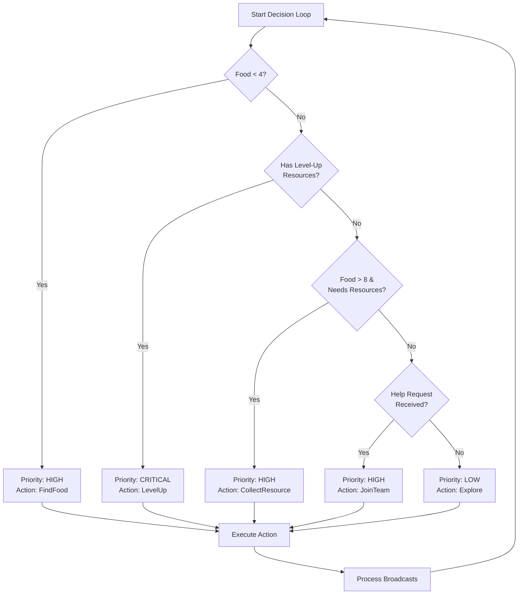

# 🧠 ZAPPY PROJECT

> **A distributed autonomous system engineered for high performance and reliability**

Welcome to the Zappy project — not just a multiplayer game, but a **production-grade distributed system** demonstrating advanced engineering concepts in concurrent programming, network protocols, and autonomous decision-making.

## 📋 Table of Contents

- [Technical Architecture & System Design](#-technical-architecture--system-design)
- [The Brain: Autonomous AI (Rust)](#-the-brain-autonomous-ai-rust)
- [Technical Highlights](#-technical-highlights)
- [About the Game](#-about-the-game)
- [Project Structure](#-project-structure)
- [Getting Started](#-getting-started)
- [Documentation](#-documentation)
- [Team](#-team)

---

## 🏗 Technical Architecture & System Design

This project is not just a game AI; it is a **distributed autonomous system** engineered for high performance and reliability using Rust. The architecture focuses on three core engineering pillars: **Asynchronous Systems**, **Memory Efficiency**, and **Type-Safe Protocol Design**.

### 1. The Autonomous Engine (State Machine)

The drone's "brain" is built as a **hierarchical State Machine**. This allows for complex, multi-objective decision-making while maintaining predictable behavior:

- **Dynamic Priority Queue**: The AI balances survival (food), resource gathering, and cooperative goals (incantations) based on real-time environmental data
- **Predictive Navigation**: Uses a relative coordinate system to navigate a wrapping (toroidal) map, optimizing movement patterns to reduce energy consumption

### 2. High-Performance Asynchronous I/O

Leveraging **Tokio**, the client implements a non-blocking event loop capable of handling high-frequency server updates:

- **Event-Driven Communication**: A custom event queue manages the race conditions between command responses (synchronous) and server notifications like broadcasts or player ejections (asynchronous)
- **Latency Reduction**: By separating the network reader from the decision engine, the AI maintains a constant heartbeat even under high network load

### 3. Robust Protocol Parsing & Memory Safety

To align with professional backend standards, the communication layer was refactored for zero-panic reliability:

- **Type-Safe Parsing**: Instead of fragile string manipulation, a custom `ServerEvent` Enum system transforms raw TCP bytes into structured data
- **Memory Footprint Optimization**: Implemented buffer reuse strategies (clearing instead of re-allocating String buffers) to minimize heap allocations and maximize CPU cache efficiency
- **Error Propagation**: Eliminated `unwrap()` and `panic!` calls in favor of a robust Result-based error handling system, ensuring the drone stays "alive" even when facing malformed server packets

### 4. Distributed Cooperation (IPC-style)

The AI implements a custom **Broadcast Protocol** to synchronize with other drones:

- **Decentralized Coordination**: Drones use encrypted-style message patterns to share locations and coordinate "Level Up" rituals without a central orchestrator
- **Signal Processing**: Implemented logic to calculate the shortest path based on the server's directional sound emission (1-8 directions)

---

## 🎯 About the Game

Zappy is a multiplayer network game inspired by science fiction. Players are immersed in a 2D world named **Trantor**, where multiple teams compete to achieve supreme elevation — a symbol of power and wisdom in this peaceful world.

### Project Goal

Each player embodies a **Trantorian**, a curious and non-violent being, evolving on a map containing various resources. The objective is to help your team progress: **the first team to have at least 6 members reach level 8 wins the game**.

### The World of Trantor

The world is a 2D flat map that is **toroidal** — exit from one side and you'll reappear on the opposite side.

Natural resources spawn over time:
- 🍗 **Food** — essential for survival
- 💎 **Minerals** — `linemate`, `deraumere`, `sibur`, `mendiane`, `phiras`, `thystame`

These resources are fundamental for survival and ascending through levels via the **incantation ritual**.

---

## 🤖 The Brain: Autonomous AI (Rust)

The AI client is the technical centerpiece of this project, demonstrating advanced problem-solving capabilities in **distributed systems engineering**.

### Decision Engine: Hierarchical State Machine

The drone operates using a **priority-based state machine** that evaluates multiple objectives simultaneously:



### Asynchronous Heartbeat (Tokio)

The AI leverages Rust's **Tokio async runtime** to manage non-blocking I/O:
- **Single TCP Reader Pattern**: Eliminates race conditions by routing all network reads through one entry point
- **Event Queue System**: Decouples command responses from asynchronous server notifications (broadcasts, ejections)
- **Concurrent Decision-Making**: The AI can process environment data while waiting for server responses

### Survival & Cooperation Strategy

The AI follows a three-pillar strategy:

1. **Priority on Food** → Survival is paramount; the drone maintains a minimum food threshold (4 units) before pursuing other objectives
2. **Resource Gathering** → Once fed, the drone systematically collects minerals required for level advancement
3. **Cooperative Level-Up** → Uses a custom broadcast protocol to coordinate with teammates for synchronized incantation rituals

**📖 Full technical details:** [AI Documentation](zappy_ai/AI_DOCUMENTATION.md)

---

## ⚡ Technical Highlights


| Technique | Implementation | Impact |
|-----------|----------------|--------|
| **Zero-Copy Parsing** | Minimized memory allocations by using string slices and reusable buffers | Reduced heap pressure, improved cache locality |
| **Robust Error Handling** | Eliminated `unwrap()` with a custom `ClientError` type and Result propagation | Zero panics in production — critical for system stability |
| **Network Protocol** | Implemented a custom event-loop to handle out-of-order server notifications | Prevents race conditions in async TCP communication |
| **Type-Safe State Machine** | Used Rust enums for both Commands and ServerEvents | Compile-time guarantees eliminate entire classes of bugs |
| **Decentralized Coordination** | Broadcast-based team synchronization without a central server | Demonstrates understanding of distributed consensus challenges |


---

## 📁 Project Structure

The project consists of three main components:

| Component | Language | Description |
|-----------|----------|-------------|
| **Server** (`zappy_server`) | C | Game server managing connections, map, resources, and game logic |
| **AI Client** (`zappy_ai`) | Rust | Autonomous AI player that connects to the server and plays the game |
| **GUI Client** (`zappy_gui`) | C++ / SFML | Graphical interface to visualize the game in real-time |

## 🚀 Getting Started

### Prerequisites

- **GCC** (for the server)
- **Rust & Cargo** (for the AI)
- **SFML** (for the GUI)

### Building the Project

Build all components from the root directory:

```bash
make
```

Or build each component individually:

```bash
# Server
cd server && make

# AI Client
cd zappy_ai && make

# GUI Client
cd zappy_gui && make
```

### Running the Game

#### 1. Start the Server

```bash
./zappy_server -p <port> -x <width> -y <height> -n <team1> <team2> ... -c <clientsNb> -f <freq>
```

**Options:**
| Flag | Description |
|------|-------------|
| `-p` | Port number |
| `-x` | Map width |
| `-y` | Map height |
| `-n` | Team names (space-separated) |
| `-c` | Number of clients allowed per team |
| `-f` | Frequency (time unit divider) |

**Example:**
```bash
./zappy_server -p 4242 -x 20 -y 20 -n team1 team2 -c 5 -f 100
```

#### 2. Start the AI Client(s)

```bash
./zappy_ai/target/debug/zappy_ai -p <port> -n <team_name> -m <machine>
```

**Options:**
| Flag | Description |
|------|-------------|
| `-p` | Server port (default: 4242) |
| `-n` | Team name to join |
| `-m` | Server hostname (default: localhost) |
| `-d` | Enable debug mode |

**Example:**
```bash
./zappy_ai/target/debug/zappy_ai -p 4242 -n team1 -m localhost
```

#### 3. Start the GUI

```bash
./zappy_gui -p <port> -h <machine>
```

**Options:**
| Flag | Description |
|------|-------------|
| `-p` | Server port |
| `-h` | Server hostname |

**Example:**
```bash
./zappy_gui -p 4242 -h localhost
```

### GUI Controls

| Key | Action |
|-----|--------|
| `Z` | Move view up |
| `Q` | Move view left |
| `S` | Move view down |
| `D` | Move view right |
| `+` | Zoom in |
| `-` | Zoom out |
| `Enter` | Switch from menu to game view |

## 📚 Documentation

- 📖 [User Documentation](documentation/USER_DOCUMENTATION_ZAPPY.txt) — How to play the game
- 🔧 [Developer Documentation](documentation/DEV_DOCUMENTATION_ZAPPY.txt) — Technical details for developers
- 🤖 [AI Technical Documentation](zappy_ai/AI_DOCUMENTATION.md) — Detailed Rust AI implementation guide

## 👥 Team

**Project by:** Aymen | Erwan | Gustave | Zoltan
