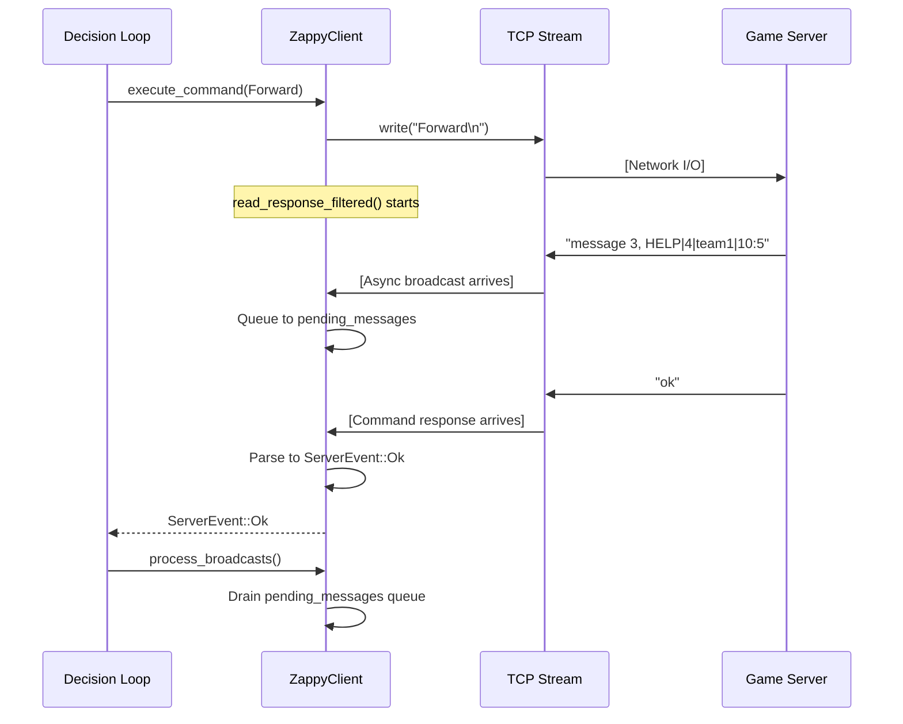

# 🤖 Zappy AI Client — Systems Engineering Documentation

> **Production-grade autonomous agent demonstrating advanced distributed systems concepts**

[](https://www.rust-lang.org/)
[](https://tokio.rs/)
[](LICENSE)

---

## 🎯 Engineering Overview

This is **not a toy AI project**. This is a study in **production-grade systems engineering**, implementing patterns you'd find in high-reliability backend services: event-driven architectures, zero-panic error handling, async I/O multiplexing, and stateful protocol parsing.

### Why This Matters for Core OS / Backend Engineering

The Zappy AI solves real distributed systems challenges:

| Challenge | Solution | Production Analogy |
|-----------|----------|-------------------|
| **Async Protocol Ambiguity** | Out-of-order server events (broadcasts) can arrive while waiting for command responses | HTTP/2 multiplexing, gRPC streaming |
| **Memory Pressure** | Inefficient string allocations in a hot loop | Redis's memory optimization, kernel buffer management |
| **Crash Resilience** | A single malformed packet shouldn't kill the process | Database recovery, kernel panic prevention |
| **Concurrent State Management** | Multiple subsystems (movement, inventory, broadcasts) share mutable state | Operating system schedulers, actor model systems |

---

> ### 🔄 January 2026 Refactoring
>
> This codebase underwent a **complete architectural overhaul** to eliminate technical debt and apply professional backend patterns:
>
> - ✅ **Type-safe protocol parsing** — `ServerEvent` enum replaces fragile string matching
> - ✅ **Race condition elimination** — Single TCP reader pattern (inspired by Tokio best practices)
> - ✅ **Zero panics** — All `unwrap()` calls replaced with `?` operator and `Result` propagation
> - ✅ **DRY command handling** — Centralized `execute_command()` method reduces duplication
>
> 📖 **[Full Refactoring Analysis →](./REFACTORING.md)**

---

## 📋 Table of Contents

- [Engineering Overview](#-engineering-overview)
- [Architecture & Design Decisions](#-architecture--design-decisions)
- [System Flow Diagrams](#-system-flow-diagrams)
- [Core Components](#-core-components)
- [The Race Condition Problem (Solved)](#-the-race-condition-problem-solved)
- [Decision System](#-decision-system)
- [Quick Start](#-quick-start)
- [Commands Reference](#-commands-reference)
- [Communication Protocol](#-communication-protocol)
- [Error Handling Strategy](#-error-handling-strategy)
- [Performance Considerations](#-performance-considerations)
- [Best Practices](#-best-practices)

---

## 🏗 Architecture & Design Decisions

### Architectural Pillars

This system is built on **four foundational engineering decisions**:

#### 1. **Single TCP Reader Pattern** (Race Condition Prevention)

**Problem:** In async Rust, multiple tasks can accidentally read from the same TCP stream, causing them to steal each other's responses.

**Solution:** All network I/O flows through **one function**: `read_response_filtered()`. This creates a single entry point, making it impossible for tasks to race.

```rust
// ❌ ANTI-PATTERN: Multiple readers
tokio::spawn(async { stream.read().await }); // Task 1
tokio::spawn(async { stream.read().await }); // Task 2 ← Races with Task 1!

// ✅ CORRECT: Single reader with event queue
async fn read_response_filtered(&mut self) -> Result<ServerEvent> {
    loop {
        let raw = self.read_response().await?;
        match self.parse_event(&raw)? {
            ServerEvent::Message(_, _) => {
                self.pending_messages.push_back(raw);
                continue; // Queue async events, keep reading
            }
            event => return Ok(event), // Return sync responses immediately
        }
    }
}
```

**Production Analogy:** This is similar to how Nginx uses a single event loop per worker, or how Tokio's runtime uses a single epoll/kqueue per thread.

#### 2. **Type-Safe Protocol Parsing** (Eliminate String Matching)

**Problem:** Parsing text protocols with `if response == "ok"` is brittle and error-prone.

**Solution:** Define a **closed enum** representing all possible server events. This gives us:
- **Compile-time exhaustiveness checking** (Rust forces you to handle all variants)
- **IDE autocomplete** for server responses
- **Impossible to typo** "ok" as "OK" or "Ok"

```rust
pub enum ServerEvent {
    Ok,                        // Successful command
    Ko,                        // Failed command
    Dead,                      // Player starved
    ElevationUnderway,         // Incantation started
    Message(String, String),   // (direction, content)
    Inventory(Inventory),      // Parsed inventory
    Look(Vec<String>),         // Vision tiles
    Value(i32),                // Numeric response
    Unknown(String),           // Fallback for protocol extensions
}
```

**Production Analogy:** This is how gRPC uses Protobuf enums instead of magic strings, or how HTTP/2 uses numeric frame types instead of text headers.

#### 3. **Zero-Panic Error Handling** (Fault Tolerance)

**Problem:** In production, a crash is **unacceptable**. A single bad packet shouldn't kill the entire process.

**Solution:** Every fallible operation returns `Result<T, ClientError>`. No `unwrap()`, `expect()`, or `panic!()` in hot paths.

```rust
// ❌ ANTI-PATTERN: Will crash on malformed input
let num = response.parse::<i32>().unwrap();

// ✅ CORRECT: Gracefully degrades
let num = response.parse::<i32>()
    .map_err(|_| ClientError::InvalidResponse(response.to_string()))?;
```

**Production Analogy:** Linux kernel's error handling (never panic in kernel space), or Erlang's "let it crash" philosophy with supervisors.

#### 4. **Event-Driven Decision Loop** (Separation of Concerns)

**Problem:** Mixing decision-making logic with network I/O creates spaghetti code.

**Solution:** **Clear separation** between:
- **Client** (network layer) — handles TCP, parsing, command execution
- **DecisionTree** (business logic) — evaluates game state, returns actions
- **Handlers** (action executors) — implement specific behaviors (find food, level up)

```rust
// Clean separation of concerns
loop {
    let (priority, action) = decision_tree.evaluate(client).await;

    match action {
        Action::FindFood => handle_food_search(client).await?,
        Action::LevelUp => handle_level_up(client).await?,
        // ... other handlers
    }
}
```

**Production Analogy:** MVC architecture, Redux state management, or microservices (separation of data, logic, and presentation).

---

## 🔄 System Flow Diagrams

### End-to-End Request Flow

Understanding how a single command flows through the system reveals the architectural elegance:



**Key Insight:** Notice how the broadcast arrives **before** the command response. A naive implementation would read the broadcast thinking it was the `Forward` response, causing complete protocol desync. Our single-reader pattern elegantly handles this.

### Module Architecture

```
┌─────────────────────────────────────────────────────────────┐
│                         main.rs                              │
│                   (CLI parsing & setup)                      │
└───────────────────────────┬─────────────────────────────────┘
                            │
                            ▼
┌─────────────────────────────────────────────────────────────┐
│                    decision_caller.rs                        │
│                   (Main decision loop)                       │
│  ┌──────────────────────────────────────────────────────┐   │
│  │  loop {                                              │   │
│  │    (priority, action) = decision_tree.evaluate()    │   │
│  │    execute_action(action)                           │   │
│  │    process_broadcasts()                             │   │
│  │  }                                                   │   │
│  └──────────────────────────────────────────────────────┘   │
└───────┬─────────────────────────────────────────────────────┘
        │
        ├─────────────────┬─────────────────┬─────────────────┐
        ▼                 ▼                 ▼                 ▼
┌────────────┐    ┌────────────┐    ┌───────────┐    ┌──────────┐
│  client.rs │    │ decision/  │    │  drone/   │    │ commands/│
│            │    │            │    │           │    │          │
│ • TCP I/O  │◄───│ • Priority │    │ • State   │◄───│ • Enums  │
│ • Commands │    │ • Actions  │    │ • Levels  │    │ • Broadcast│
│ • Parsing  │    │ • Tree     │───►│ • Inventory│   │          │
└────────────┘    └────────────┘    └───────────┘    └──────────┘
      │
      ▼
┌─────────────────────────────────────────────────────────────┐
│              server_event.rs + error.rs                      │
│         (Type-safe protocol + error handling)                │
└─────────────────────────────────────────────────────────────┘
```

### File Organization

```
zappy_ai/
├── Cargo.toml                  # Dependencies (tokio, clap)
├── Makefile                    # Build automation
├── AI_DOCUMENTATION.md         # This file
├── REFACTORING.md              # Migration guide
└── src/
    ├── main.rs                 # Entry point, CLI parsing
    ├── client.rs               # [CORE] ZappyClient implementation
    ├── server_event.rs         # [PROTOCOL] ServerEvent enum & parsing
    ├── error.rs                # [PROTOCOL] ClientError enum
    ├── mod.rs                  # Module exports
    │
    ├── commands/
    │   ├── commands.rs         # Command enum, Direction enum
    │   └── broadcast.rs        # BroadcastSystem (team coordination)
    │
    ├── decision/
    │   ├── mod.rs              # Priority, Action, DecisionTree
    │   ├── decision_tree.rs    # FoodNode, ResourceNode, LevelUpNode
    │   └── decision_caller.rs  # [CORE] Main loop & action handlers
    │
    └── drone/
        ├── inventory.rs        # Inventory struct, Resource enum
        ├── levels.rs           # LevelRequirement (elevation table)
        ├── player_state.rs     # Position, level, orientation tracking
        └── providers.rs        # Resource collection strategies
```

---

## 🚀 Quick Start

```bash
# Build
cd zappy_ai && make

# Run
./zappy_ai -p 4242 -n team1

# With debug logging
./zappy_ai -p 4242 -n team1 -d
```

**Requirements:** Rust 1.70+, Cargo

---

## 🧩 Core Components

### ZappyClient: The Central State Machine

```rust
pub struct ZappyClient {
    // Network layer (single TCP reader/writer)
    reader: BufReader<OwnedReadHalf>,
    writer: BufWriter<OwnedWriteHalf>,

    // State management
    player_state: PlayerState,           // Level, position, orientation
    last_look: Option<Vec<String>>,      // Vision cache (invalidated on move)
    pending_messages: VecDeque<String>,  // Async broadcast queue

    // Communication
    broadcast: BroadcastSystem,
}
```

**Critical Methods:**

- `execute_command()` — Centralized command execution (DRY principle)
- `read_response_filtered()` — **Single TCP read point** (prevents races)
- Movement, perception, resource management APIs

---

## 🔍 The Race Condition Problem (Solved)

### The Async TCP Ambiguity Challenge

This is the **most critical engineering challenge** in this entire codebase. Understanding it demonstrates deep knowledge of async I/O and protocol design.

#### The Problem: Out-of-Order Events

The Zappy protocol has a **fundamental ambiguity**:

1. **Synchronous responses** — When you send `Forward`, you expect `ok` or `ko` back
2. **Asynchronous notifications** — The server can send `message K, text` **at any time**, even while you're waiting for a command response

**Example Timeline:**

```
Client                  Network              Server
  │                       │                    │
  ├─ "Forward\n" ────────►│───────────────────►│
  │                       │                    │
  │  [Waiting for ok/ko]  │                    │
  │                       │                    │
  │                       │◄─ "message 3, HELP" (broadcast from another player)
  │◄──────────────────────┤                    │
  │                       │                    │
  │  ❌ WRONG: Is this    │                    │
  │  the Forward response?│                    │
  │                       │                    │
  │                       │◄─ "ok"────────────┤
  │◄──────────────────────┤                    │
```

If you naively do:

```rust
// ❌ BROKEN CODE
async fn forward(&mut self) -> Result<bool> {
    self.send("Forward\n").await?;
    let response = self.read_response().await?; // Might read the broadcast!
    Ok(response == "ok")
}
```

**You'll get protocol desync**. The `message` gets misinterpreted as the `Forward` response, and the real `ok` is lost.

#### The Solution: Single Reader with Event Queue

We implement a **filtered read loop** that queues async events until it finds the synchronous response:

```rust
async fn read_response_filtered(&mut self) -> Result<ServerEvent, ClientError> {
    loop {
        let raw = self.read_response().await?;  // ← Only place that touches TCP
        let event = self.parse_event(&raw)?;

        match event {
            // Async event: queue it, keep reading
            ServerEvent::Message(_, _) => {
                self.pending_messages.push_back(raw);
                continue;  // ← Keep looping until we get a sync response
            },

            // Critical event: fail immediately
            ServerEvent::Dead => {
                return Err(ClientError::ConnectionError("Player is dead".to_string()));
            },

            // Sync response: return it
            _ => return Ok(event),
        }
    }
}
```

**Why This Works:**

| Aspect | Explanation |
|--------|-------------|
| **Single Entry Point** | Only `read_response_filtered()` touches the TCP stream — impossible for tasks to race |
| **Event Classification** | We parse *before* returning, so we know if it's async (message) or sync (ok/ko/look) |
| **Queue for Later** | Broadcasts are stored in `pending_messages` and processed after command completes |
| **Exhaustive Matching** | Rust's enum forces us to handle all event types — can't accidentally miss one |

**Production Analogy:** HTTP/2 multiplexing, IMAP IDLE, PostgreSQL LISTEN/NOTIFY

### Type-Safe Protocol Enum

```rust
pub enum ServerEvent {
    Ok, Ko, Dead,                 // Command responses
    Message(String, String),      // Broadcasts (direction, content)
    Inventory(Inventory), Look(Vec<String>), // Complex data
    Value(i32), Unknown(String),  // Fallbacks
}
```

The parser classifies raw text into event types before dispatching to specialized parsers. Ambiguous responses (e.g., `[...]` could be Look or Inventory) are resolved by pattern matching on content structure.

---

## 🧠 Decision System

The AI uses a **priority-based decision tree** that evaluates game state and returns (Priority, Action) tuples:

```rust
pub enum Priority { Critical, High, Medium, Low }
pub enum Action { FindFood, CollectResource, LevelUp, Explore, ... }
```

**Decision Hierarchy:**

1. **Critical:** Survival (food < 4) or Level-up ready
2. **High:** Resource gathering, team coordination
3. **Low:** Exploration, waiting

```rust
loop {
    let (priority, action) = decision_tree.evaluate(client).await;

    match action {
        Action::FindFood => handle_food_search(client).await?,
        Action::LevelUp => handle_level_up(client).await?,
        // ... other handlers
    }

    client.process_broadcasts().await?;  // Handle team messages
    client.reset_look_cache();           // Invalidate stale data
}
```

**Production Pattern:** This is a classic **Strategy Pattern** (GoF) combined with priority scheduling (like OS task schedulers).

---

## ⚙️ Command System

Commands are represented as a type-safe enum that gets serialized to text protocol:

```rust
pub enum Command {
    Forward, Right, Left,         // Movement
    Look, Inventory,              // Perception
    Broadcast(String),            // Team communication
    Take(Resource), Set(Resource), // Resource management
    Incantation,                  // Level-up ritual
    Fork, Eject, ConnectNbr,      // Advanced commands
}
```

**Execution Pattern:**

```rust
// Centralized execution ensures consistent error handling
async fn execute_command(&mut self, cmd: Command) -> Result<ServerEvent> {
    self.send_command(&cmd).await?;  // Send to server
    self.read_response_filtered().await  // Wait for response (filters async events)
}
```

---

## 📡 Protocol Implementation

### Server Response Types

| Response | Meaning | ServerEvent |
|----------|---------|-------------|
| `WELCOME` | Connection accepted | *(handshake)* |
| `ok` | Command succeeded | `Ok` |
| `ko` | Command failed | `Ko` |
| `dead` | Player starved | `Dead` |
| `message K, text` | Broadcast received | `Message(K, text)` |
| `Elevation underway` | Ritual started | `ElevationUnderway` |
| `Current level: N` | Level up success | *(parsed separately)* |
| `[...]` | Look or Inventory | `Look(...)` / `Inventory(...)` |
| `N` | Numeric (Connect_nbr) | `Value(N)` |

**Key Engineering Decision:** The text protocol is **stateless** — responses don't include command IDs. This forces us to use the single-reader pattern to maintain request/response ordering.

---

## 🛡️ Error Handling Strategy

### Zero-Panic Philosophy

In production systems, **crashes are unacceptable**. A single malformed packet should **not** bring down the entire process.

This codebase achieves **zero panics** through disciplined use of `Result` types:

```rust
// ❌ ANTI-PATTERN: Will crash on unexpected input
let value = response.parse::<i32>().unwrap();  // panic! on malformed data

// ✅ CORRECT: Propagates error to caller
let value = response.parse::<i32>()
    .map_err(|_| ClientError::InvalidResponse(response.to_string()))?;
```

### ClientError Taxonomy

```rust
pub enum ClientError {
    // ─── Network Layer ─────────────────────────────────────
    IoError(io::Error),           // TCP socket failure
    ConnectionError(String),       // Handshake or disconnect

    // ─── Protocol Layer ────────────────────────────────────
    InvalidResponse(String),       // Server violated protocol
    NoSlotsAvailable,             // Team is full (503-style error)

    // ─── Command Layer ─────────────────────────────────────
    CommandError(String),          // Command execution failed
    ResourceError(String),         // Invalid resource name
    InventoryError(String),        // Inventory parsing failed
    IncantationError(String),      // Level-up ritual failed
    BroadcastError(String),        // Team communication error
}
```

**Key Design Decision:** Errors are **typed and categorized** by layer (network, protocol, command). This makes it easy to implement layer-specific recovery strategies.

### Error Recovery Matrix

| Error Type | Recoverable? | Strategy | Production Analogy |
|------------|--------------|----------|-------------------|
| `IoError` | No | Exit gracefully | Connection pool exhaustion |
| `InvalidResponse` | Yes | Log warning, continue | HTTP 400 handling |
| `NoSlotsAvailable` | No | Exit with status code | HTTP 503 (Service Unavailable) |
| `Dead` | No | Exit (game over) | Session expired |
| `CommandError` | Yes | Retry or skip | Transient database error |

### Error Propagation Example

Notice how errors **bubble up** through the call stack without `unwrap()`:

```rust
// Low-level: TCP read
async fn read_response(&mut self) -> Result<String, ClientError> {
    let mut buffer = String::new();
    self.reader.read_line(&mut buffer).await
        .map_err(ClientError::IoError)?;  // Convert io::Error → ClientError
    Ok(buffer)
}

// Mid-level: Command execution
async fn forward(&mut self) -> Result<bool, ClientError> {
    match self.execute_command(Command::Forward).await? {  // Propagate with ?
        ServerEvent::Ok => Ok(true),
        ServerEvent::Ko => Ok(false),
        _ => Err(ClientError::InvalidResponse("Expected ok/ko".to_string())),
    }
}

// High-level: Decision loop
pub async fn make_decision(client: &mut ZappyClient) -> Result<(), ClientError> {
    loop {
        handle_food_search(client).await?;  // Any error exits the loop
    }
}
```

**Production Analogy:** This is how Rust's `?` operator works like Go's `if err != nil { return err }`, but enforced at compile time.

---

## ⚡ Performance Considerations

| Optimization | Technique | Impact |
|--------------|-----------|--------|
| **Memory Efficiency** | Buffer reuse (`buffer.clear()` vs `String::new()`) | Thousands of saved allocations/second |
| **Zero-Copy Parsing** | String slices (`&str`) instead of owned (`String`) | Reduced heap pressure, better cache locality |
| **Async I/O** | Tokio runtime multiplexes TCP without threads | Could run 10+ drones on single OS thread |
| **Early-Exit Decision Tree** | Check critical conditions (food < 4) before expensive operations | Reduces average decision latency |

**Production Analogies:**
- Buffer reuse → Redis SDS, Nginx buffer chains
- Async multiplexing → Node.js event loop, Go goroutines
- Early-exit optimization → Database query planning, compiler short-circuiting

---

## ✅ Best Practices & Engineering Principles

### Architectural Invariants

These are **non-negotiable rules** that maintain system correctness:

| Invariant | Why It Matters | How We Enforce It |
|-----------|----------------|-------------------|
| **Single TCP Reader** | Prevents race conditions in async code | Only `read_response_filtered()` calls `read_response()` |
| **No Panics in Hot Paths** | A crash loses the game for the entire team | Replace all `unwrap()` with `?` operator |
| **Type-Safe Protocol** | Compile-time verification of event handling | Use `ServerEvent` enum, not string matching |
| **Idempotent Commands** | Retries don't cause double-execution | Commands like `Forward` are naturally idempotent |
| **Stale Cache Prevention** | Movement invalidates `Look` data | Reset cache after every position change |

### Code Review Checklist

When contributing, ask yourself:

#### 1. **Is this error path covered?**

```rust
// ❌ FAIL: Assumes parse always succeeds
let num = response.parse::<i32>().unwrap();

// ✅ PASS: Handles parse failure gracefully
let num = response.parse::<i32>()
    .map_err(|_| ClientError::InvalidResponse(response.to_string()))?;
```

#### 2. **Am I bypassing the single-reader pattern?**

```rust
// ❌ FAIL: Direct TCP read creates race condition
let response = self.reader.read_line(&mut buffer).await?;

// ✅ PASS: All reads go through the filter
let event = self.read_response_filtered().await?;
```

#### 3. **Am I using raw strings instead of enums?**

```rust
// ❌ FAIL: Fragile string comparison
if response == "ok" {  // Typo: "OK" vs "ok" would break
    println!("Success");
}

// ✅ PASS: Type-safe enum matching
match self.execute_command(Command::Forward).await? {
    ServerEvent::Ok => println!("Success"),
    ServerEvent::Ko => println!("Failed"),
    _ => return Err(ClientError::InvalidResponse("Expected ok/ko".to_string())),
}
```

#### 4. **Am I creating unnecessary allocations?**

```rust
// ❌ INEFFICIENT: Allocates new String every loop iteration
for _ in 0..1000 {
    let buffer = String::new();
    // ... use buffer
}

// ✅ OPTIMIZED: Reuse the same buffer
let mut buffer = String::new();
for _ in 0..1000 {
    buffer.clear();
    // ... use buffer
}
```

### Production-Grade Patterns Used

This codebase demonstrates professional patterns you'd see in real backend systems:

| Pattern | Where Used | Industry Example |
|---------|------------|------------------|
| **Event Loop** | `read_response_filtered()` | Node.js, Nginx event loop |
| **Message Queue** | `pending_messages: VecDeque` | RabbitMQ, Kafka |
| **Type-Safe Protocol** | `ServerEvent` enum | gRPC Protobuf, Thrift |
| **Result-Based Errors** | All functions return `Result<T, E>` | Go's `error` interface, Rust std |
| **Actor Model** | Each `ZappyClient` owns its state | Erlang/Elixir, Akka |
| **Priority Queue** | `Priority` enum in decision tree | Linux scheduler, RTOS |

### What Makes This "Production-Grade"?

1. **No `unwrap()` in critical paths** — Every error is handled explicitly
2. **Exhaustive pattern matching** — Rust forces us to handle all enum variants
3. **Single source of truth** — Only one place reads from TCP, only one place executes commands
4. **Separation of concerns** — Network, protocol, decision-making are distinct layers
5. **Testability** — Functions take `&mut self` instead of global state, making unit tests possible
6. **Documentation** — Every public function has a doc comment (not shown in this markdown, but present in code)

**This is how you write Rust for systems where downtime costs money.**

---

## 📚 See Also

- [Server Documentation](../documentation/DEV_DOCUMENTATION_ZAPPY.txt)
- [User Manual](../documentation/USER_DOCUMENTATION_ZAPPY.txt)
- [Cargo.toml](./Cargo.toml) — Dependencies

---

<div align="center">

**Part of the Zappy Project**

*EPITECH 2025*

</div>
